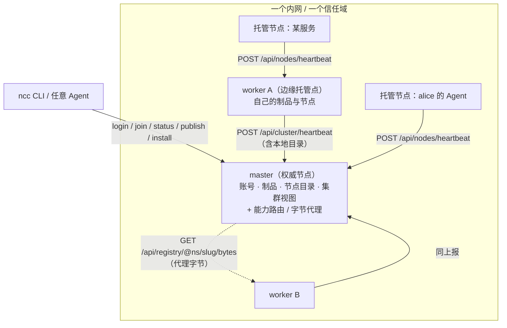

# ncc-registry · 内网托管节点

一个**单二进制**的内网 Registry 服务：把「**制品托管**」「**节点托管**」「**Agent 发现与互联**」
三件事收在一个进程里，并支持**多节点**（一个 `master` + 若干 `worker`）横向铺开。

它属于 [`ncc-cli`](../README.md) 这个开源/可分发的部分：Go 单二进制、SQLite 单文件、
内置 Web 控制台，不依赖平台私有代码，也不引入外部数据库或对象存储就能跑。

```bash
go build -o dist/ncc-registry ./cmd/ncc-registry
NCCR_PORT=8282 ./dist/ncc-registry          # → http://localhost:8282
```

## 三件事

| 能力 | 说明 | 主要接口 |
|---|---|---|
| **制品托管** | 账号 / 命名空间 / 发布 / 检索 / 下载 / 分发；`sha256` 校验、`@命名空间/slug` 稳定引用 | `/api/auth/*`、`/api/registry*` |
| **内网托管节点** | 用户把内网的 Agent / 服务**注册 + 心跳**托管进来，声明「我是谁、在哪、能干什么」 | `/api/nodes/heartbeat`、`/api/nodes` |
| **Agent 发现与互联** | 在同一信任域内发现彼此、收进连接表、按区域聚合；问「这个能力该找哪个节点要」 | `/api/nodes/discover`、`/api/nodes/links`、`/api/nodes/route` |
| **接入：key/secret 或内网短链** | 一条内网短链（或 key+secret）就能把一个 Agent 加进来；兑换出的是**最小权限的节点令牌** | `/api/access/*`、`/j/:key` |
| **授权：连接 ≠ 授权** | 私有制品 / 私有节点要显式 `grant`；撤销立即生效（支持按命名空间限定） | `/api/grants*` |
| **多节点（master/worker）** | worker 注册 + 心跳上报本地目录；master 聚合目录、做能力路由、代理字节，还能把制品**分发**到 worker 并在下架时**回收** | `/api/cluster*` |

## 架构



**权威在 master**：账号、制品、节点目录都以 master 为准；worker 是**边缘托管点**——
它自己也托管制品与节点，并定期把「我这里有什么」报给 master。客户端（CLI / Agent）
只要认识 master 一个地址：查目录看聚合结果，下载时 master 会去持有者那里把字节代理回来；
要让内网某个/全部 worker 也持有副本，master 把条目**分发**过去（见 §集群写）。

## 快速开始

### ① 单节点（最小形态）

```bash
cd ncc-registry
go build -o dist/ncc-registry ./cmd/ncc-registry
NCCR_DATA_DIR=./data ./dist/ncc-registry          # master，默认 :8282
# 控制台 http://localhost:8282
```

### ② master + worker（多节点）

```bash
# 终端 1：master
NCCR_PORT=8282 NCCR_DATA_DIR=./data/master NCCR_NODE_NAME=office-master \
  NCCR_NODE_REGION=上海-内网 ./dist/ncc-registry

# 终端 2：worker（在另一台机器上就用它的内网 IP）
NCCR_ROLE=worker NCCR_PORT=8283 NCCR_DATA_DIR=./data/worker-a \
  NCCR_NODE_NAME=office-worker-a NCCR_NODE_REGION=上海-内网 \
  NCCR_MASTER_URL=http://127.0.0.1:8282 NCCR_HEARTBEAT=15s ./dist/ncc-registry
```

worker 启动即 `join`，之后每 `NCCR_HEARTBEAT` 心跳一次，把本地目录一并报上去。
master 侧 30s 清理一次失联 worker（`4 × NCCR_NODE_TTL`）及其目录。

> 字节放独立盘 / NAS：加 `NCCR_BLOB_DIR=/mnt/nas/ncc-blobs`（库存哪儿用 `NCCR_DB_PATH`），
> 见 [目录与存储](#目录与存储)。

### ③ CLI 接进来（Agent 插件视角）

```bash
N=./cli/target/release/ncc                    # 或装好的 ncc

# 登录某个 ncc-registry 节点
$N --base http://localhost:8282 registry login --email you@corp.com --password '***'

# 把这台机器作为一个节点托管进去（--daemon 常驻心跳）
$N registry join --kind agent --name my-mac --region 上海-内网 --capabilities mcp,api

# 看本节点 / 集群 / 我的节点
$N registry status
$N registry nodes --kind agent                # 发现本实例上可连接的节点
$N registry catalog                           # 聚合目录（本节点 + 各 worker）
$N registry route @alice/hotel-skill          # 这个能力该找哪个节点要
$N registry leave --name my-mac               # 下线我的节点

# 接入票据 / 分发 / 下架回收 / 授权
$N registry ticket create --label "给 alice 的 Agent" --uses 1 --expires 7
$N registry ticket list && $N registry ticket rm TK-…
$N registry replicate @alice/hotel-skill --to all
$N registry rm @alice/hotel-skill --yes
$N grant set --user @bob --kind artifact      # 连接 ≠ 授权：拿私有东西要显式授权
$N grant set --user @bob --kind node

# 既有的制品命令照旧可用（同一个 HTTP 契约）
$N publish --file ./hotel.SKILL.md --kind skill --name "Hotel Skill" --slug hotel-skill --replicate all
$N search skill --tag hotel
$N install @alice/hotel-skill                 # 即使是 worker 上的，也走 master 代理
```

### ④ 用一条短链把别人加进来

```bash
# 签发一次（key + secret + 内网短链；secret 只显示这一次）
$N registry ticket create --label "给 alice 的 Agent" --uses 1 --expires 7
#  → key NK-7F3A2C · secret ab1b98… · http://localhost:8282/j/NK-7F3A2C#ab1b98…

# 把链接发给对方，对方一条命令直接接入（含入网）
$N registry add 'http://localhost:8282/j/NK-7F3A2C#ab1b98…' --join --kind agent --region 上海-内网
# 或分开填 key/secret：
$N registry add --base http://localhost:8282 --key NK-7F3A2C --secret ab1b98… --join
```

浏览器打开链接会看到接入页（自动读取 fragment 里的 secret，给出可复制的命令 + 一键验证）。

## 概念与边界

- **托管节点 vs 集群节点**：托管节点是*用户内网里的东西*（Agent / 服务，`/api/nodes/*`）；
  集群节点是*跑 ncc-registry 的实例本身*（`/api/cluster/*`）。两者都在，但别混。
- **节点自己声明类型**：`service`（服务）/ `agent`（为人服务的 Agent）/ `assigned`（被分配的 Agent），
  在上报时给出（`ncc registry join --kind`），不是连接方决定的。
- **注册与心跳是同一件事**：第一次上报即注册，之后每次上报续租 `LastSeen`；
  在线与否由 `NCCR_NODE_TTL` 判定，**不落库**（避免心跳写放大）。
- **连接 ≠ 授权**：`/api/nodes/links`（`ncc nodes link`）只是我这边的「找得到」清单，
  同一实例即信任域，不需要对方审批；取私有制品仍要另配授权（见 Roadmap）。
- **目录权威不下放**：master 是目录权威；worker 上报的是「我这里有」的声明，
  聚合只用于发现与路由，不替代权威记录。

## 接入：key/secret 与内网短链

内网里加一个 Agent，不该要求对方去注册账号、拼 `--base`。签一张**接入票据**即可：

| 形态 | 长什么样 | 给谁用 |
|---|---|---|
| key + secret | `NK-7F3A2C` + 32 位 secret | 手工填（key 短、可念；secret 只显示一次，库里只存 sha256） |
| 接入短链 | `http://host:8282/j/NK-7F3A2C#<secret>` | 直接发链接，对方 `ncc registry add '<链接>' --join` 一条命令接入 |

- **secret 放 URL fragment（`#`）**：浏览器不会把它发给服务端，因此不进访问日志、不进 `Referer`。
  所以短链自带凭据，而服务端从未拥有完整凭据。
- 票据可限次（`--uses`）、可过期（`--expires`）、可删除；兑换记在 `used_count` 上。
- 兑换出的是**节点令牌**（JWT `kind=node`），作用域默认 `nodes:write, registry:read, registry:download`：
  只能续租**它自己的那个节点**、只能读公开制品，不能发布、不能进别人的命名空间。
- 兑换时可以顺手入网（请求带 `node` 字段）—— `ncc registry add … --join` 就是这一步。
- 节点归属**签发者**的命名空间（默认个人空间）：Agent 接进来后直接出现在你的「我的节点」里。

## 授权：连接 ≠ 授权

连接（`/api/nodes/links`）只解决「找得到」；要「拿得到」必须有 `Grant`：

| 类型 | 放开什么 |
|---|---|
| `artifact` | 拉取我命名空间下的私有 / 草稿制品（可按命名空间限定） |
| `node` | 在 discover 里看到并连接我的私有托管节点 |

```bash
ncc grant set --user @bob --kind artifact            # 全部命名空间的制品
ncc grant set --user @bob --kind artifact --ns @team # 只放开 @team
ncc grant set --user @bob --kind node                # 私有节点可见/可连
ncc grant list            # 我给出的（--in 看别人给我的）
ncc grant rm <id>         # 撤销，立即生效
```

私有条目的字节地址是**短时签名地址**（`HMAC(secret, ref|exp)`，默认 10 分钟）：
因为 `ncc download` 拉字节时不会再带 `Authorization`，所以拿到元数据的那一刻服务端就给它一条
能自证的 URL —— 未授权者既拿不到元数据，也伪造不了签名。

## 集群写：分发（replicate）与回收（revoke）

```bash
ncc publish --file ./x.SKILL.md --kind skill --name X --replicate all   # 发布即分发到全部 worker
ncc registry replicate @alice/x --to office-worker-a                   # 事后补分发
ncc registry rm @alice/x --yes                                         # 下架 + 回收各处副本
```

- master 把「条目 + 短时签名地址」推给 worker（`POST /api/cluster/ingest`，集群 token 鉴权）；
- worker 自己去拉字节并**校验 sha256**，落成 `origin=replica` 的副本（本地不可改，改要走源头）；
- master 侧记一份分发台账（`replica_targets`）—— 下架时据此回收，**不依赖 worker 心跳是否已上报**
  （心跳有延迟，刚分发完就下架得能收干净）；全部回收成功才清账；
- 回收只删副本，worker 自己发布的条目不受影响（`revoke` 只动 `origin=replica` 的行）。

## 目录与存储

节点只用本地磁盘，**放哪里都能配**（内网部署最常见的诉求：字节放 NAS / 独立盘，库存本地 SSD）：

| 目录 | env | 默认 | 装什么 |
|---|---|---|---|
| 数据根 | `NCCR_DATA_DIR` | `./data` | `node-id`、`jwt-secret`，以及下面两项的默认落脚点 |
| 制品字节 | `NCCR_BLOB_DIR` | `<data>/blobs` | **上传写这里、下载从这里读**（经 `/blobs/*` 公开） |
| 库文件 | `NCCR_DB_PATH` | `<data>/ncc-registry.db` | SQLite 库（含 `-wal` / `-shm`） |

- **相对路径按数据根解析**，不是按当前工作目录 —— 换个目录启动不会忽地换地方；
  解析完成后统一转成**绝对路径**，启动日志与 `GET /api/meta` 里报出的就是真正生效的路径：

  ```console
  $ NCCR_DATA_DIR=/srv/ncc NCCR_BLOB_DIR=/mnt/nas/ncc-blobs NCCR_DB_PATH=/srv/ssd/ncc.sqlite ./ncc-registry
    数据根   /srv/ncc
    制品字节 /mnt/nas/ncc-blobs   （上传写这里，下载从这里读）
    库文件   /srv/ssd/ncc.sqlite
  ```

- 服务启动时会自动建目录（含库文件的父目录）；目录不可写时直接报错退出，不会静默回退。
- 字节目录里就是普通文件（文件名随机化），**可以直接拿系统工具看、拷、备份**：

  ```bash
  ls /mnt/nas/ncc-blobs                      # 每个制品一个文件
  ```

- **备份**：库 + 字节目录（可能在不同盘上），或整包 `NCCR_DATA_DIR`（默认布局下二者都在里面）。
  身份与密钥在数据根下，**丢了两样都会换身份**：`node-id` 变了在集群里就是个新节点。
- **共享/只读目录**：`NCCR_BLOB_DIR` 指向挂载的共享目录时，多个节点可以共看同一批字节，
  但“写入”仍各自都在自己那份（本服务不做多写者协调）。

## 配置（`NCCR_*`）

| 变量 | 默认 | 说明 |
|---|---|---|
| `NCCR_ROLE` | `master` | `master`（权威节点）\| `worker`（边缘托管点） |
| `NCCR_PORT` | `8282` | 监听端口（刻意与平台的 8181 错开，两者可同机共存） |
| `NCCR_DATA_DIR` | `./data` | 数据根（自动创建）：`node-id` + `jwt-secret`，以及下面两项的默认落脚点 |
| `NCCR_BLOB_DIR` | `<data>/blobs` | **制品字节目录**：上传写这里、下载从这里读（经 `/blobs/*` 公开）；相对路径按数据根解析 |
| `NCCR_DB_PATH` | `<data>/ncc-registry.db` | SQLite 库文件（可与数据根分开，比如库存本地 SSD、字节放 NAS） |
| `NCCR_PUBLIC_URL` | `http://localhost:<port>` | 别人怎么访问本节点（下载 URL、控制台、集群上报都用它） |
| `NCCR_NODE_NAME` | 主机名 | 节点名 |
| `NCCR_NODE_REGION` | 空 | 节点区域（如 `上海-内网`；发现与区域聚合按它分类） |
| `NCCR_NODE_ID` | 自动生成并持久化 | 本节点 id（改它等于换一个节点身份） |
| `NCCR_JWT_SECRET` | 自动生成并持久化 | HS256 密钥（生产建议显式设置） |
| `NCCR_JWT_TTL` | `168h` | 登录态有效期 |
| `NCCR_ACCESS_TTL` | `720h` | 接入票据兑换出的节点令牌有效期（票据本身带过期时间时取更短的那个） |
| `NCCR_MASTER_URL` | 空 | **worker 必填**：master 地址 |
| `NCCR_CLUSTER_TOKEN` | 空 | 配了则 worker 注册/心跳必须带 `X-NCC-Cluster-Token`；空 = 内网开放接入 |
| `NCCR_HEARTBEAT` | `15s` | worker 心跳间隔 |
| `NCCR_NODE_TTL` | `60s` | 托管节点/worker 的在线判定窗口（master 按 `4×` 清理 worker） |
| `NCCR_INVITE_CODE` | 空 | 空 = 内网开放注册；设了则注册必须带邀请码（逗号分隔多个） |
| `NCCR_CONSOLE` | `true` | 是否托管内置 Web 控制台 |
| `NCCR_CORS_ORIGINS` | 空 | 跨域白名单（逗号分隔，`*` 全放行） |

> 约定：`NCCR_*` 与平台的 `NCC_*` 互不干扰，两套服务可以并排跑在同一台机器上。

## API 速查

公开（读）：

| 方法/路径 | 说明 |
|---|---|
| `GET /api/health` · `GET /api/meta` | 存活与本节点自述（角色 / 节点 id / 规模 / 控制台地址） |
| `GET /api/registry/kinds` | 制品类型与数量 |
| `GET /api/registry?q=&kind=&tag=&namespace=&page=&size=` | 目录检索（本节点权威） |
| `GET /api/registry/<@ns/slug\|A-…>` | 制品详情 |
| `GET /api/registry/<ref>/download` | 下载元数据（`url` / `sha256` / `size` / `via`） |
| `GET /api/registry/<ref>/bytes` | 真正的字节流（本节点有就发；没有就从 worker 代理） |
| `GET /api/nodes/discover?kind=&region=&q=` | 本实例上可连接的公开节点 |
| `GET /api/nodes/regions` | 区域覆盖（各区域在线 / 总数） |
| `GET /api/nodes/route?ref=` | 能力路由：谁持有这个制品 + 统一入口地址 |
| `GET /api/access/tickets/:key` | 票据概要（公开，不含 secret） |
| `GET /j/:key` | 接入短链落地页（secret 在 fragment，服务端看不到） |
| `GET /api/cluster` · `GET /api/cluster/workers` | 集群总览（master + 各 worker） |
| `GET /api/cluster/directory?q=&kind=&tag=` | 聚合目录（本地 + 远端，条目带 `via`；本地条目带 `replicas`） |

需登录（`Authorization: Bearer <JWT 或 ncc_ API-Key>`）：

| 方法/路径 | 说明 |
|---|---|
| `POST /api/auth/register` · `POST /api/auth/login` | 注册（自动开个人命名空间）/ 登录 |
| `GET /api/auth/me` · `PATCH /api/auth/me` | 当前身份 / 改名改密 |
| `GET\|POST\|DELETE /api/auth/keys[/:id]` · `GET /api/auth/key-scopes` | API-Key 与作用域 |
| `GET /api/namespaces/mine` · `POST /api/namespaces` | 我的命名空间 / 建组织命名空间 |
| `POST /api/registry/uploads` | 上传字节（raw body + `X-Filename`；响应含 `sha256`） |
| `POST /api/registry` · `PATCH/DELETE /api/registry/<ref>` | 创建 / 修改 / 删除条目 |
| `GET /api/nodes` | 我的托管节点 + 我连接的节点 |
| `POST /api/nodes/heartbeat`（别名 `POST /api/namespaces/living`） | 托管节点注册 + 心跳 |
| `DELETE /api/nodes/:id` | 下线我的节点 |
| `POST /api/nodes/links` · `PATCH\|DELETE /api/nodes/links/:id` | 连接 / 改 Name 标签 / 断开 |
| `GET /api/grants?direction=outgoing\|incoming` · `POST /api/grants` · `DELETE /api/grants/:id` | 分发授权（`artifact` \| `node`）：连接 ≠ 授权 |
| `POST /api/access/redeem` | 用 key + secret 兑换节点令牌（可选同时入网：body 带 `node`） |
| `GET\|POST /api/access/tickets` · `DELETE /api/access/tickets/:id` | 签发 / 列出 / 删除接入票据 |
| `POST /api/cluster/replicate` | 把制品分发到 worker（`targets: "all"` 或名称/id 列表） |
| `POST /api/cluster/join` · `POST /api/cluster/heartbeat` | worker 注册 / 心跳（master 侧） |
| `POST /api/cluster/ingest` · `POST /api/cluster/revoke` | 节点间：落副本 / 回收副本（集群 token 鉴权） |

作用域：`registry:read|download|publish`、`nodes:read|write`、`keys:write`（写蕴含读）。

错误体统一 `{"error":{"code":"…","message":"…"}}`，HTTP 状态码同步语义
（400 参数 / 401 未认证 / 403 无权限 / 404 不存在 / 409 冲突 / 413 过大 / 502 节点不可达）。

## Web 控制台

`GET /` 是内置的单文件控制台（`internal/httpapi/web/index.html`，随二进制 embed，无构建步骤）：
本节点身份与规模、集群 worker 列表（在线状态 / 制品数 / 最近心跳）、聚合目录（可搜索）、
托管节点发现（含区域覆盖），以及 CLI / HTTP 的接入速查。

## 部署

### Docker Compose（master + worker 示例）

```bash
cd deploy
docker compose up -d --build            # master :8282，worker :8283
```

`deploy/docker-compose.yml` 里两个服务共用同一镜像、不同 `NCCR_ROLE`；
数据分别落在具名卷里。生产上把 worker 部署到各内网机器，`NCCR_MASTER_URL` 指向 master 即可。

### 裸二进制 / systemd

```bash
NCCR_DATA_DIR=/var/lib/ncc-registry \
NCCR_NODE_NAME=office-master \
NCCR_NODE_REGION=上海-内网 \
NCCR_CLUSTER_TOKEN=<随机串> \
  /usr/local/bin/ncc-registry
```

单进程 + 单文件目录：备份 = 打包 `NCCR_DATA_DIR`（库 + `blobs/` + `node-id` + `jwt-secret`）。

## 冒烟测试

```bash
bash scripts/smoke.sh      # 自带启停：master + worker 两节点，端口 18282/18283
```

覆盖：集群注册与心跳、制品注册/上传/发布/检索/下载、托管节点心跳与区域覆盖、
聚合目录（`via=worker`）、能力路由、**master 代理 worker 字节且 `sha256` 一致**、
**接入票据（短链形态 / 令牌最小权限 / 错 secret 与次数用尽被拒）**、
**授权（私有制品与私有节点：未授权不可见 → 授权后可见可取 → 撤销后立即失效）**、
**集群写（发布即分发 → worker 副本 sha256 一致且不可本地改 → 下架回收副本）**、
**存储目录可配置（字节/库/数据根各指一处，且默认布局不变）**。
当前 61 项检查全绿。

## 与其它组件的关系

| 组件 | 关系 |
|---|---|
| `cli/`（ncc） | 官方客户端。`ncc registry …` 是面向本服务的命令组；`publish/search/install/nodes/living` 等既有命令复用同一 HTTP 契约 |
| `packages/ncc-cli` | npm 包装，装的是同一个 `ncc` 二进制 |
| `ncc-platform/` | 平台侧（私有）的 Registry 与产品页。**本服务不依赖它**：契约同构、代码独立 |
| `agent/` | 把 NCC 能力以 MCP 暴露给任意 Agent 的 harness manifest（与本服务配合使用） |

## Roadmap（尚未实现，按需推进）

- **制品签名与版本锁定**：目前是 `sha256` 校验 + 版本号，未做发布者签名。
- **字节面增强**：本地磁盘 → S3 兼容对象存储（Ceph RGW / MinIO）；worker 侧缓存策略与失效。
- **跨网互联**：目前是同内网直连 HTTP；跨网需要打洞/中继（属于 Gateway 范畴，见平台 prd）。
- **票据的可观测性**：票据使用记录（谁、何时、哪台机器兑换）目前只记最后使用时间与次数，
  没有逐次审计；节点令牌无法单独吊销（改票据作用域或换密钥需重签）。
